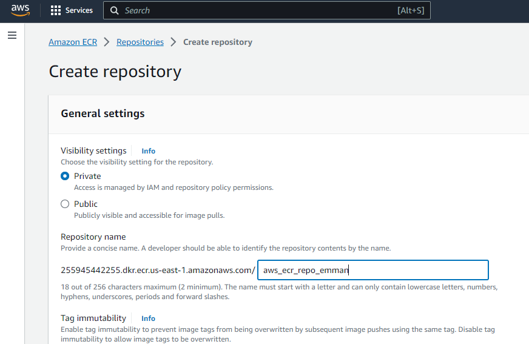
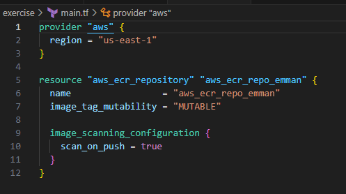

# PUSHING TO ECR

## Assignment details
In this assignment, is to run an application, prepare the registry in ECR for the image.
Create the docker image and pust the image to the AWS ECR.

The application will uose the official python run time and install/update the PIP package

To see that the pythong application is working properly, in this working directory, run

"pip install"

## Creating AWS ECR
In creating AWS ECR, the two options are one of the common way to create.

First option, using the AWS Console at the Elastic Container Registry.
Go to the Elastic Contoainer Registry services, click repositories then click create registry button
In this example, the careated registry name is aws_ecr_repo_emman
Look in the list of repositories to verify the ECR

Second option, using the Terraform AWS resource.
Create a terraform file. Ensure to include the AWS provider.
In the terminal prompt, run "terraform init", "terraform plan", "terraform apply".
If all successful, go to AWS Console site then go to Elastic Container Registry service.
Look in the list of repositories to verify the ECR

## Docker Image creation
To put the application in a container, run the docker command "docker build -t <image name> .". 
For this instance, run the command using the ECR reposiotry created "aws_ecr_repo_emman"

docker build -t aws_ecr_repo_emman .

Note: If your are running using Windows WSL, ensure that Docker desktop is running and dont forget the dot "." at the end of the build command to tell docker create the image of the currenct folder. 

To verify the image build is successful in docker, run "docker images". 

## Pushing Docker images into ECR
Run the following command to push the image into AWS ECR using AWS CLI :

aws ecr get-login-password --region us-east-1 | docker login --username AWS --password-stdin 255945442255.dkr.ecr.us-east-1.amazonaws.com

If it is succeessful, it will prompt see "Login Succeeded" and it means it retrieved the authentication token and authenticate the Docker client to
the registry. 

Then tag the image in order to push the image to the repository.

docker tag aws_ecr_repo_emman:latest 255945442255.dkr.ecr.us-east-1.amazonaws.com/aws_ecr_repo_emman:latest

If no error, push the image to the AWS ECR.

docker push 255945442255.dkr.ecr.us-east-1.amazonaws.com/aws_ecr_repo_emman:latest
